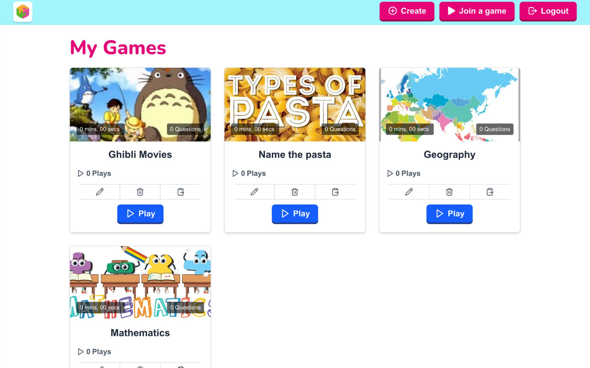

# BigBrain - Kahoot-Style Quiz Platform (React)

Demo Static Version: https://jasonwidjajadev.github.io/bigbrain-static-demo/

A real-time multiplayer quiz platform inspired by Kahoot. This project implements a full React single-page application where administrators can
create and manage quiz games while players join live sessions and compete in real time.

The system supports game creation, live session management, and player participation with dynamic question rendering and scoring.

## Project Screenshots

Full Project screenshots and UI walkthrough can be viewed here:  [BigBrain UI Screenshots](BigBrain.pdf)

---

# Features

## Admin Features

-   User authentication (register, login, logout)
-   Create and manage quiz games
-   Add, edit, and delete quiz questions
-   Configure question types, time limits, points, and media
-   Start and stop live quiz sessions
-   View game results and statistics

## Player Features

-   Join a quiz session via session ID
-   Enter a display name
-   Participate in real-time quiz rounds
-   Submit answers during countdown timers
-   View results and scores after the game ends

---

# Tech Stack

- Frontend: - React - JavaScript - Tailwind
- Backend: - REST API (provided backend)
- Testing: - Vitest - Cypress

---

# Getting Started

## Clone the repository

- git clone

## Install dependencies

- cd frontend
- npm install

## Run the application

- npm start
- The application will run at: http://localhost:3000

------------------------------------------------------------------------

# Running Tests

- Run Tests: npm run test
- Run linting: npm run lint

------------------------------------------------------------------------

# Example Game Flow

1.  Admin logs in
2.  Admin creates a quiz game
3.  Admin adds questions
4.  Admin starts a session
5.  Players join using the session ID
6.  Admin advances questions
7.  Players answer within time limits
8.  Results are displayed

------------------------------------------------------------------------

# Learning Outcomes

-   Building React single-page applications
-   Managing multiplayer user flows
-   Integrating frontend with REST APIs
-   Writing component and UI tests

------------------------------------------------------------------------

# Author

Jason Widjaja &  Mark Batsoulis